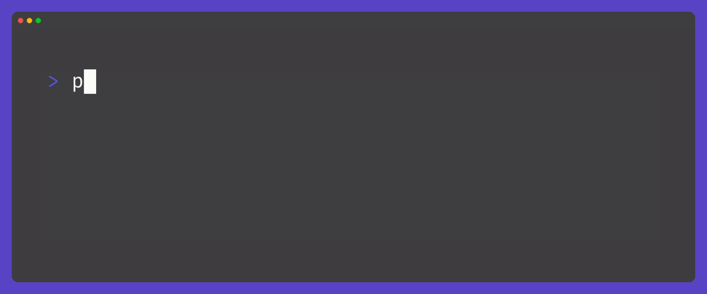

<p align="center">
  <h3 align="center">PaperCrypt</h3>
    <p align="center">Printable Backup Documents</p>
    <p align="center">
      <a href="https://goreportcard.com/report/github.com/TMUniversal/papercrypt/v2"></a>
      <a href="https://pkg.go.dev/github.com/TMUniversal/papercrypt"></a>
      <a href="https://github.com/TMUniversal/papercrypt/releases"></a>
      <a href="https://github.com/TMUniversal/papercrypt"></a>
    </p>
</p>

---

PaperCrypt is a Go-based command-line tool designed to enhance the security of your sensitive data through the
generation of printable backup documents.
These documents, referred to as "PaperCrypt" Documents, combine the robust
encryption capabilities of the [OpenPGP](https://gopenpgp.org/)
with the resilience and simplicity of a physical hardcopy.
This ensures the confidentiality and integrity of your data,
while also providing a physical backup that 's not susceptible to digital threats.

> Please note that to decrypt the data from a PaperCrypt Document, you will need the original passphrase used during the
> encryption process.
> Treat this passphrase with care; if it is lost, the data will be irrecoverable.

## Features

- **Encryption**: PaperCrypt utilizes the [GopenPGP](https://gopenpgp.org/) library to apply advanced cryptographic
  techniques, securing your data with industry-standard algorithms.

- **PDF Generation**: PaperCrypt can output PDF documents ready for printing, that include all the information needed to
  recover the encrypted data.

- **Data Integrity**: To verify the integrity of the data, PaperCrypt embeds checksums within the encrypted data section
  of its documents. This ensures that the data remains unaltered during backup and restoration processes.

- **Offline Security**: By generating printable backup documents, PaperCrypt offers an offline solution to
  safeguard your sensitive data against online threats, as well as an option to store your data in an off-site
  location. This provides a layer of security, as it ensures that your data remains safe and accessible even in the
  event of a catastrophic failure, malicious attack, or natural disaster.

## Installation

### Pre-built binaries

Pre-built binaries for PaperCrypt are available for download from
the [releases](https://github.com/TMUniversal/papercrypt/releases) page.

> The pre-built binaries are preferred over manual installation, as they include version information. The GitHub
> releases also included signatures for the binaries.

#### Homebrew (Linux, macOS)

```bash
brew tap TMUniversal/homebrew-tap
brew install papercrypt
```

#### Scoop (Windows)

Make sure you have [scoop](https://scoop.sh/) installed,
alongside `git` (`scoop install git`) to be able to add the bucket.

```bash
scoop bucket add tmuniversal https://github.com/tmuniversal/scoop-bucket.git
scoop install papercrypt
```

### From source (manual)

1. **Install Go**: Ensure you have Go installed. If not, you can download it from [here](https://go.dev/dl/).

2. **Clone the Repository**: Clone the repository to your local machine:

```bash
git clone https://github.com/TMUniversal/papercrypt.git
```

3. **Navigate to the Directory**:

```bash
cd papercrypt
```

4. **Build the binary**:

Build using [`task`](https://taskfile.dev/#/installation):

```bash
task build
```

or through [`goreleaser`](https://goreleaser.com/install/):

```bash
goreleaser build --snapshot --clean --single-target
```

### From source (go install)

> This method is not recommended, as it won't include the version information in the binary.

1. **Ensure Go is installed**: See [step 1 from manual installation](#from-source-manual).
2. **Install PaperCrypt**: Run the following command to install PaperCrypt:

```bash
go install github.com/tmuniversal/papercrypt/v2@latest
```

### Running with Docker

You can also run PaperCrypt using Docker, with the following command:

```bash
docker run --rm -it -v $(pwd):/data ghcr.io/tmuniversal/papercrypt:latest
```

With `-v $(pwd):/data` mounting the current working directory as `/data` in the container,
allowing the container to read and write to host storage.

On Windows, the command is slightly different:

```bash
docker run --rm -it -v ${PWD}:/data ghcr.io/tmuniversal/papercrypt:latest
```

Note that `-t` is required so that the program can prompt for a passphrase.

### Verifying artifacts

First, you'll need to download the archive and signature file (`.sig`) for your version from
the [releases page](https://github.com/TMUniversal/papercrypt/releases), pay attention to the
version (`papercrypt version`), your OS and architecture. You will also need the public key ([`cosign.pub`]).

The pre-built binaries are signed through [`cosign`](https://github.com/sigstore/cosign#installation).

To verify the signature, you can run the following command:

```bash
cosign verify-blob \
  --key cosign.pub \
  --signature papercrypt_$(uname -s)_$(uname -m).tar.gz.sig \
  papercrypt_$(uname -s)_$(uname -m).tar.gz
```

and for Windows:

```bash
cosign verify-blob \
  --key cosign.pub \
  --signature papercrypt_Windows_x86_64.zip.sig \
  papercrypt_Windows_x86_64.zip
```

## Usage

General notes:

- `--in` and `--out` can be omitted, in which case `stdin` and `stdout` are used.
- This means `papercrypt decode --in - --out - < qr.txt > data.json` is equivalent
  to `papercrypt decode < qr.txt > data.json`
- Commands, as well as their flags, can be abbreviated to their shortest unique prefix:
  - `papercrypt generate` can be abbreviated to `papercrypt g`
- that is `papercrypt generate --in data.json --out output.pdf` can be abbreviated
  to `papercrypt g -i data.json -o output.pdf`

### Generating a key phrase

A 24 word mnemonic phrase is suitable for real-world use,
but you can use any string of words or characters.

Generate one with your tool of choice,
you can run:

```bash
papercrypt generate-key --words 24 --out mnemonic.txt
```

to generate a 24 word mnemonic phrase.

[](examples/)

#### The passphrase sheet

PaperCrypt is able to generate a printable _Phrase Sheet_,
which is a two-page document containing 135 words from the EFF large word list,
chosen with a seeded random number generator.

If no seed is passed to the command, one will be generated using the system's entropy source.

[Example](examples/phrase.pdf):

```bash
papercrypt phrase-sheet --out phrase-sheet.pdf ExampleAbcA=
```

Here, `ExampleAbcA=` is the base64-encoded seed, which is used to generate the word list.
The seed will is also present on the generated PDF document,
so you can regenerate the same word list later, even if you allowed the seed to be chosen at random.

Using the phrase sheet, you can select a number of words from to form your mnemonic phrase.

### Generating a PaperCrypt document

Save your data as a file, `data.json`, for example:

```json
{
  "prop": "value",
  "another_property": "another_value",
  "a_number": 123,
  "a_boolean": true,
  "an_array": ["a", "b", "c"],
  "an_object": {
    "another_property": "another_value"
  }
}
```

Then, run

```bash
papercrypt generate --in data.json --out output.pdf
```

to generate the file containing your data, and the decryption instructions.

The program then asks you for an encryption key,
for which you can use your mnemonic phrase from earlier.

> You can also pass the data through `stdin`, simply omit the `--in` flag.
> The caveat is that, when on Windows, you can't be prompted for your passphrase,
> so you would have to pass it with the `--passphrase` flag.

[](examples/output.pdf)

Please see the [examples](examples) directory for the generated PDF files.

### Restoring a PaperCrypt document

To restore your data from a PaperCrypt document,
you must first re-construct the document from the printed copy.
This can be done either by saving the QR code as an image file,
and [passing it to the command-line](#using-the-qr-code),
or by copy-pasting the text from the printed document (would have to run [OCR](https://www.adobe.com/acrobat/guides/what-is-ocr.html "optical character recognition")).

#### Using the QR code

Save the 2D code as an image file (a screenshot should do), for example `2d.png`.

Then, run

```bash
papercrypt scan --in 2d.png --out data.txt
```

#### Decoding from text

Once you have the text from the printed document,

<details>
<summary>Click to expand</summary>

which should look something like this:

```
# PaperCrypt Version: 2.0.0
# Content Serial: EIPESR
# Purpose: Example Sheet
# Comment: Regular PDF Example
# Date: Thu, 01 Aug 2024 20:38:10.306596100 +0200
# Data Format: PGP
# Content Length: 390
# Content CRC-24: d6f1c0
# Content CRC-32: bc4b3672
# Content SHA-256: NT7wwW5Tq5fk1J82M1tzE82VGxIlad5vpF5cDMzg+yg=
# Header CRC-32: ecded03b


 1: 1F 8B 08 00 00 00 00 00 02 FF 00 6A 01 95 FE C3 2E 04 09 03 08 7A D49E51
 2: 7D 43 1C 18 E4 C9 19 E0 23 B0 2A D5 58 E1 72 93 E0 06 BB F2 7E C8 D183B9
 3: 2F C9 00 C8 90 6D 83 04 E9 22 FB 07 98 BB 4D 68 CE 04 96 D2 C0 77 730736
 4: 01 01 8D 41 D1 46 E3 82 11 09 E7 15 77 1C EB 92 26 FE 5A B2 84 C3 462812
 5: B4 98 DC D2 27 C1 B1 AF 22 B6 3B CB 95 DC D8 4D 0A 4E FF ED 8E A2 0B74A2
 6: DF C1 72 41 7F 08 AF 9C 43 EA 50 9C 43 30 84 4F F8 82 BC 62 4A 0E DFCF21
 7: 27 91 DF 15 9E 1C 3F 37 77 FB D2 E0 4A F1 73 3E 2D 7B 73 47 96 35 E94DF5
 8: 55 F9 A4 D2 7F 4C 24 4A 0B A1 04 1B 49 95 91 5C D0 6B E2 AF 2D AC 361154
 9: 98 E4 22 BB 62 61 BB 93 97 9A 04 4B 7B AC BF 86 7E 7B DE AB B3 83 9DD5D4
10: A9 66 F3 99 D7 94 2E 4E 72 E6 6D 09 35 11 68 A9 B7 6C EE 5E BC 3F E27CAE
11: E6 1B C7 5A 76 B0 B1 E5 DB 7A 56 13 23 DB 9C 23 8F 85 FF 72 60 56 252FD9
12: F4 26 17 EA 2E AE 05 D7 0F 02 78 A5 BE 3A 61 F0 39 EE 31 4F D6 E3 2ECC66
13: 7E 84 E6 99 D1 E7 71 CE 5D 34 6F A2 1D 66 74 1A 09 FC E2 81 91 AB 444B35
14: AC 88 A5 93 14 38 37 FD BA 49 5E B7 3F 33 55 D0 83 D8 2C 48 35 FF AE678F
15: 54 F5 38 85 EC C8 4E 37 03 B9 22 C7 50 58 7F BD 04 0C 8E EE 8B B9 B26C81
16: E4 6B C0 67 C6 18 54 0D F1 20 73 D8 FC 40 D3 D2 90 00 0F 84 7E BD C47477
17: 1D 67 D8 71 AD 2D D3 89 43 54 8A F5 33 CD 0E AF B0 80 08 29 68 59 E37012
18: 53 15 99 01 00 00 FF FF CC 08 E8 C8 6A 01 00 00 2436D9
19: D6F1C0
```

Note the two empty lines between the header and the data.

</details>

Decode and decompress the data:

```bash
papercrypt decode --in data.txt --out data.json
```

The command prompts for the encryption key, which you could specify with `--passphrase|-P`:

```bash
papercrypt decode -i data.txt -o data.json -P "super-secret-key"
```

### Full pipeline

[](examples/output.pdf)

## Contributing

Contributions to PaperCrypt are welcomed and encouraged! If you have suggestions for improvements, bug fixes, or new
features, please feel free to submit a pull request.
Refer to [CONTRIBUTING.md](CONTRIBUTING.md) for more information.

## License

PaperCrypt is licensed under the terms of the GNU Affero General Public License, version 3.0 or
later ([GNU AGPL-3.0-or-later](COPYING)).

[](https://www.gnu.org/licenses/agpl-3.0.en.html)

## Acknowledgments

PaperCrypt is developed leveraging the power of Go and a suite of dependable open source libraries.
We extend our gratitude to the developers behind
[GopenPGP](https://github.com/ProtonMail/gopenpgp), [GoFPDF](https://github.com/jung-kurt/gofpdf),
and other foundational components.

[`cosign.pub`]: https://github.com/TMUniversal/papercrypt/blob/main/cosign.pub
